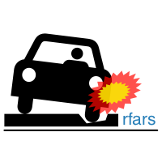

<!-- 
  README.md is generated from README.Rmd, so you should edit that file.
-->

```{r, echo = FALSE}
knitr::opts_chunk$set(comment  = NA,
                      fig.path = "man/figures/README-")
```

# rfars 

## Workflow to create an R package

In order to create this package, I followed the following steps:

1. Follow the steps described in [the check lists of Roger D. Peng](https://github.com/rdpeng/daprocedures/blob/master/README.md).
2. Fill the DESCRIPTION file with the information of your package.
3. Document the code in the folder [R](./R) with roxygen2-style documentation.
4. Delete the NAMESPACE file when you create the package's project and allow that `roxygen2` creates this file with the function `document()`.
